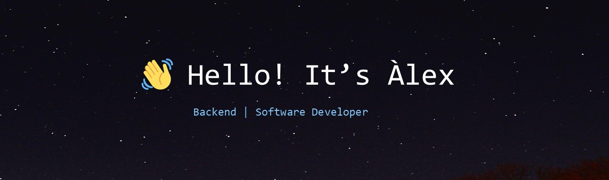

Hello! I’m Alex, a backend developer specialized in Java with over 3 years of experience in web application development.😊 

 

  

##  My Recent Projects 

 1. [ERP Hotel](https://github.com/AlexVallTuru/HotelErp-SpringBoot)
 2. [Recolifter](https://github.com/AlexVallTuru/Recolifter)
 3. [Git Lite](https://github.com/AlexVallTuru/GitLite-MongoDB)
 4. [Client-server game](https://github.com/AlexVallTuru/Server_JocCarreraDeCaballs)
 5. [MP3 player](https://github.com/AlexVallTuru/ReproductorMP3)

##  **Languages and Tools:**  

 

##  **Algorithms** [LeetCode](https://leetcode.com/u/alexvallturu/)

 

     

